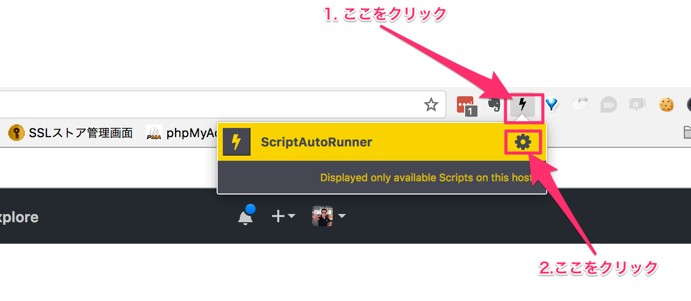
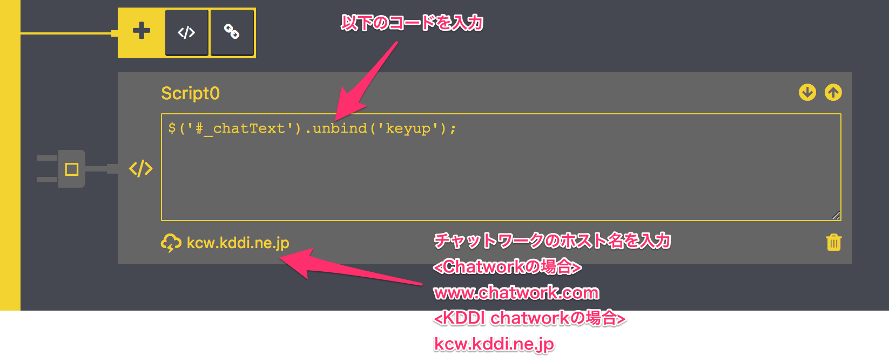
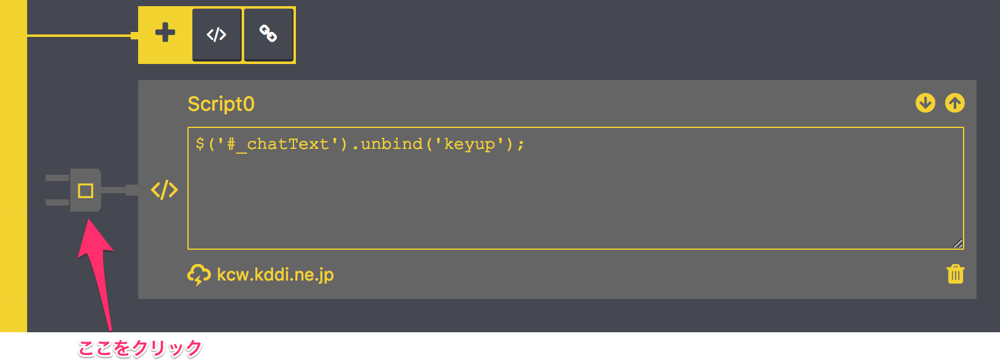

## Chatworkのメッセージ入力時に、Enterキー (or Enter + Shift)押下による誤送信を防ぐ方法

1. Chromeの拡張機能で以下をインストールする
  - https://chrome.google.com/webstore/detail/scriptautorunner/gpgjofmpmjjopcogjgdldidobhmjmdbm
<br><br>

2. 図のとおりにアイコンをクリック

<br><br>

3. 開かれる画面にて以下の部分をクリック

<br><br>

4. 以下の通りにコードを入力  
 - コード入力欄  
 ```javascript
 $('#_chatText').unbind('keyup');
 ```

 - ホスト名入力欄  
   - Chatworkの場合： `www.chatwork.com`  
   - KDDI Chatworkの場合： `kcw.kddi.ne.jp`  


<br><br>

5. 以下の通りにコンセント部分をクリック

<br><br>

6. 以下の画面の通り、黄色の背景になったら設定完了なので、タブを閉じてOK

<br><br>

7. Chatworkの画面をリロードして完了
  - これで、Enterキーないし、Enter+Shiftを押しても、送信されなくなる。 (送信の際は送信ボタンの押下が必要。)
